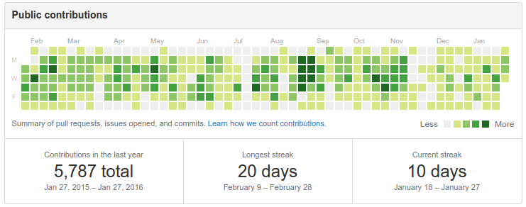

## Une nouvelle génération de packages 

AKA le ["Hadleyverse"](https://github.com/hadley/) 



## Une nouvelle génération de packages 

`dplyr`, `tidyr`, `ggplot2` bien sûr, `ggvis`, `httr`, `rvest`, etc. 

## Des packages centrés sur le point fort de `R`

`dplyr` et `tidyr` sont des réimplémentations de `plyr` et `reshape` spécialisés sur les dataframes.

## Une syntaxe renouvelée

Deux principes :

- l'usage de verbes - c'est-à-dire une fonction qui prend un data.frame comme premier argument (`group_by`, `summarise`, `select`, `filter`, `arrange`, `spread`, `gather`)
- l'usage du pipe `%>%` (qui se lit "then" et vient du package `magrittr`)

## 

```{r, message=FALSE}
library(nycflights13)
library(dplyr)
flights

````

## Permet une lecture plus aisée du code

````{r, message=FALSE}

flights %>%
  filter(carrier %in% "UA")

````

## Permet une lecture plus aisée du code

````{r, message=FALSE}

flights %>%
  filter(carrier %in% "UA") %>%
  select(year, month, day, carrier, origin, dest)

````


## Permet une lecture plus aisée du code

````{r, message=FALSE}

flights %>%
  group_by(year, month, day) %>%
  summarise(delay = mean(arr_delay, na.rm = TRUE))

````

## Permet une lecture plus aisée du code

````{r, message=FALSE}

flights %>%
  group_by(paste(year, month, day, sep = "-")) %>%
  summarise(delay = mean(arr_delay, na.rm = TRUE)) %>%
  arrange(desc(delay))

````

## Permet une lecture plus aisée du code

```{r, message=FALSE}

flights %>%
  mutate(date = paste(year, month, day, sep = "-")) %>%
  group_by(date) %>%
  summarise(delay = mean(arr_delay, na.rm = TRUE)) %>%
  arrange(desc(delay))

```

## Résumé des principaux verbes

- `group_by` : crée des groupes
- `summarise` : agrège un dataframe ou un un groupe en une ligne
- `filter` : subset en fonction de conditions logiques
- `select` : sélectionne certaines variables seulement
- `arrange` : trie le data.frame selon certaines variables
- `mutate` : crée de nouvelles variables

## Et aussi...

- `count` : nombre de lignes
- `do` : permet de faire n'importe quelle opération sur des groupes (ex : `lm`)
- sélection aisée de variables : `data %>% select(varA:varZ)` ou encore `data %>% select(-varB)`
- joins (en style SQL)
- `sample_n()` et `sample_frac`
- écrit en C++, donc *rapide*


## Les `tables` peuvent venir de sources différentes

- de `datatable`
- et SURTOUT de bases de données !

## 

```{r}
my_db <- src_sqlite("my_db.sqlite3", create = T)
flights_sqlite <- copy_to(my_db, flights, temporary = TRUE, indexes = list(
  c("year", "month", "day"), "carrier", "tailnum"))

flights_sqlite %>%
  filter(origin == "JFK") %>%
  arrange(desc(distance))
  

````

## Oui, mais...

- on ne peut pas programmer avec `dplyr` ?
    + si : avec les fonctions spéciales du type `select_`

- il n'y a pas d'autocomplétion dans Rstudio ?
    + si : ça arrive
    
- Il n'y a pas de parallélisation possible ?
    + Non, pas encore, mais c'est prévu.
    
    
## `tidyr`, un complément logique de `dplyr`

`tidyr` est à `dplyr` ce que `reshape` est à `plyr`.

Deux (et deux seulement !) fonctions :

- `gather` (format large -> format long)
- `spread` (format long -> format large)

avec un système clé-valeur

##

```{r, message=FALSE}
library(tidyr)
messy <- data.frame(
  name = c("Wilbur", "Petunia", "Gregory"),
  a = c(67, 80, 64),
  b = c(56, 90, 50)
  )
  
messy %>%
  gather(drug, heartrate, a:b)

````


## Pour conclure

`dplyr`, `tidyr` et d'autres packages permettent :

- une écriture plus fluide
- une plus grande efficacité et rapidité
- une plus grande abstraction
- d'avoir une plus belle beau et des cheveux brillants.

Alors, n'hésitez plus !